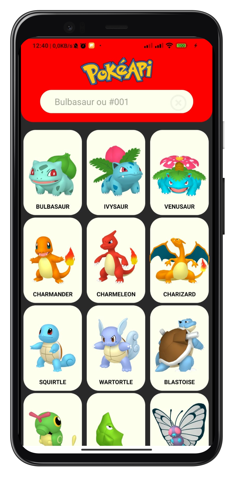
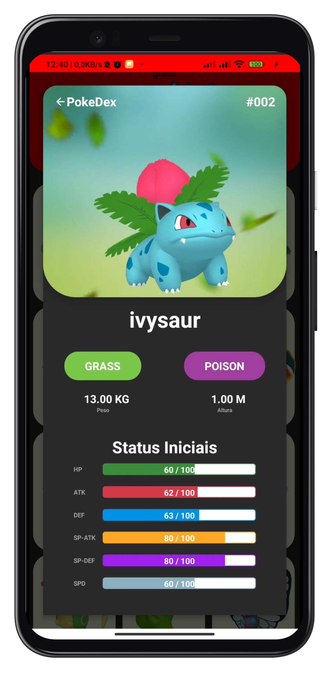
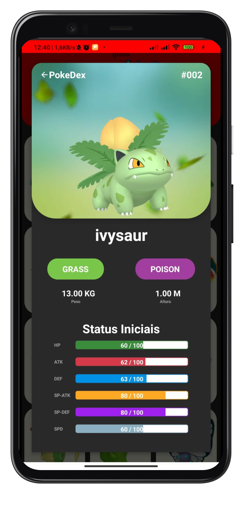

<h1 align="center">
  Pokedex
</h1>

  <a href="#-preview">Preview</a>&nbsp;&nbsp;&nbsp;|&nbsp;&nbsp;&nbsp;
  <a href="#-tecnologias">Tecnologias</a>&nbsp;&nbsp;&nbsp;|&nbsp;&nbsp;&nbsp;
  <a href="#-projeto">Projeto</a>&nbsp;&nbsp;&nbsp;|&nbsp;&nbsp;&nbsp;
  <a href="#-como-executar">Como executar</a>&nbsp;&nbsp;&nbsp;|&nbsp;&nbsp;&nbsp;
  <a href="#-licença">Licença</a>

 

 ## 🖼️ Preview
 

 <h3>Screenshots<h3/>
  
  
  
  
  

 

    <h3>GIF<h3/>

 

## ✨ Tecnologias

Esse projeto foi desenvolvido com as seguintes tecnologias:

  
 
  
  
## 💻 Projeto

O app "Pokedex" lista todos os pokemons e suas informações(tipo, peso, altura, baseStatus, versão shiny, ...).

## 🚀 Como executar
#### - No Android
- Baixe o [APK](./Pokedex.apk) 
- Instele e comece a usar!

 
#### - No expo
- Tenha o [Expo](https://expo.io/) instalado
- Clone o repositório
- Instale as dependências com `yarn`
- Inicie o servidor com `yarn start`

Agora você pode acessar pelo seu aparelho utilizando o aplicativo da Expo ou tendo um emulador na sua maquina.

## Open API

Pokedex usando o [PokeAPI](https://pokeapi.co/) para construir a API RESTful.   
PokeAPI fornece uma interface RESTful API para objetos altamente detalhados construídos a partir de milhares de linhas de dados relacionados a Pokémon.

## 📄 Licença

Esse projeto está sob a licença MIT. Veja o arquivo [LICENSE](LICENSE.md) para mais detalhes.

---

